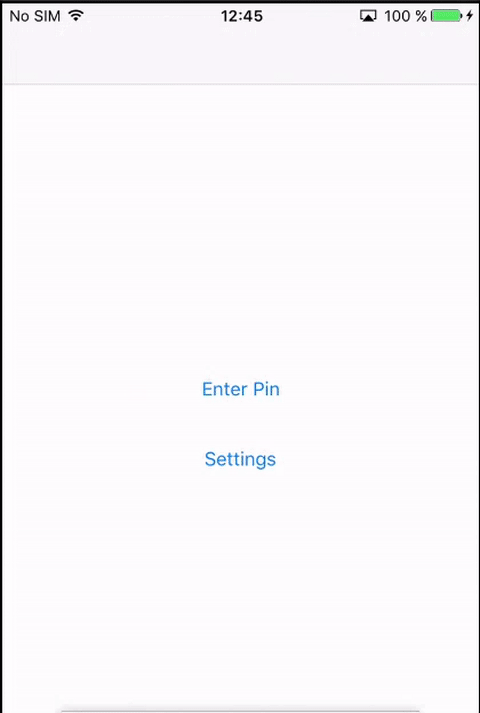

CZSecurityTouchID
=============

CZSecurityTouchID secures your app by requiring a Touch ID fingerprint or passcode.

Validation                |  Adjustment
:-----------------------:|:-------------------------:
  |   

Installation
------------
The easiest way to get started is to use [CocoaPods](http://cocoapods.org/). Just add the following line to your Podfile:

```ruby
pod 'CZSecurityTouchID'
```

Usage
-----

### 1. import the class
```obj-c
#import <T21FingerPrint.h>
```

### Create a simple validation view

In order to conform to the PinViewControllerValidate protocol you have to adopt it in your UIViewController
```obj-c
ViewController () <PinViewControllerValidateDelegate>
```

To conform to the PinViewControllerValidateDelegate you have to implement the following functions:
```obj-c
-(void)pinViewControllerDidSetWrongPin:(pinViewAction)action{
    
}
-(void)pinViewControllerDidSetСorrectPin:(pinViewAction)action{    
}
```

To create a validation view
```obj-c
UIViewController *vc = [[FingerPrint sharedInstance] createPinViewWithScope:PinViewControllerScopeValidate WithvalidationDelegate:self];
```
* `Scope`: 
	* PinViewControllerScopeValidate : the view for request the pin or finger print (Need to have some pin saved)
	* PinViewControllerScopeCreate : the view for create a new pincode
	* PinViewControllerScopeChange : the view for change the pincode
	*  PinViewControllerScopeDesactive : the view to delete the pincode
* `validationDelegate`:  PinViewControllerValidateDelegate
This method return to UIViewController and you can add in your navigation flow

### Create an adjustment view that covers all scope
Is a simple view to configure all the options of the pin and touch id

To create a setting view
```obj-c
UIViewController *vc = [[FingerPrint sharedInstance] createSettingViewWithAppearance:nil withPinViewControllerAppearance:nil];
```
This method return to UIViewController and you can add in your navigation flow

### Other Setting 

**Setting up length For Pin code**
By default is 4
```obj-c
[[FingerPrint sharedInstance] setLengthForPin:4];
```

**Setting up the validation view appearance**
```obj-c
PinAppearance * appearance = [[PinAppearance alloc] init];
appearance.logo = [UIImage imageNamed:@"sc_logo"];
/*You can configure all the attributes you need */
[FingerPrint sharedInstance].appearance = appearance;
```

**Setting up the adjustment view appearance and PinCode View**
```obj-c
SettingsAppearance *SettingAppearance = [[SettingsAppearance alloc] init];
SettingAppearance.titleGroupText = @"Group title";
/*You can configure all the attributes you need */

PinAppearance * pinAppearance = [[PinAppearance alloc] init];
appearance.logo = [UIImage imageNamed:@"sc_logo"];
/*You can configure all the attributes you need */
 [[FingerPrint sharedInstance] createSettingViewWithAppearance:SettingAppearance withPinViewControllerAppearance:pinAppearance];
```
